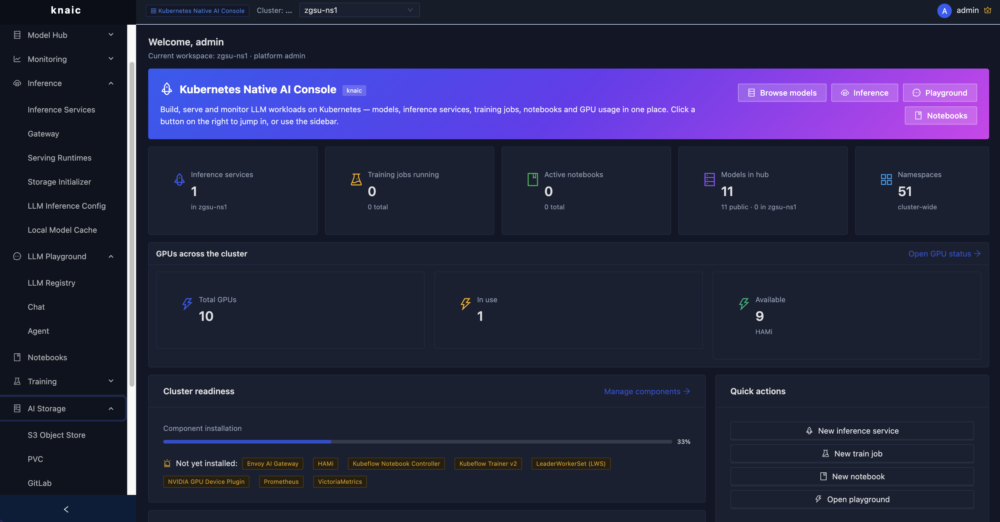
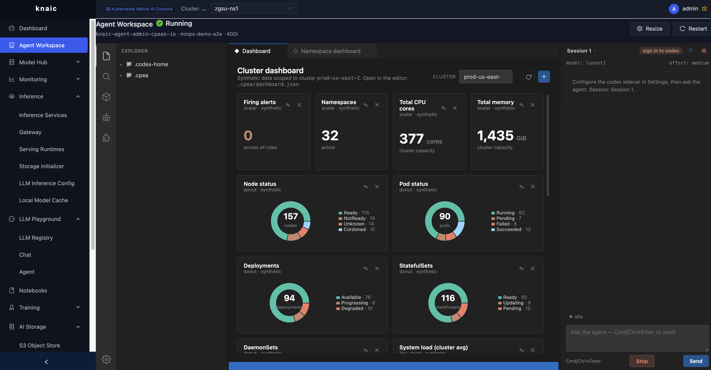

# knaic — 云原生 AI 控制台

> 一个可以跑在单节点上的轻量 LLM / MLOps / AI 容器平台。控制台构建在你
> 已经在用的主流开源 MLOps 组件之上 —— KServe、Kubeflow、Volcano、
> MLflow、Prometheus。

[English](./README.md) · [简体中文](./README_CN.md) · [企业版](https://www.alauda.io/)

knaic 把企业内部 AI 平台的日常工作流 —— 模型仓库、推理服务、Notebook、
训练任务、监控、对话 Playground、以及每用户独享的 Agent 工作空间 —— 收
进一个 Go 二进制 + 一个 React 前端里。在 k3s/k8s 单节点上即可运行,适合
笔记本上的本地演示;对接到生产 Kubernetes 集群时也按同样的方式横向扩展。

## 截图

| 仪表盘 | Agent 工作空间 |
|---|---|
|  |  |

## 功能特性

**模型与推理**
- 🧩 **组件管理**:通过内置 Helm 目录一键安装 KServe、Volcano、Hami、
  Kubeflow Notebooks / Trainer、MLflow 等组件,并能识别集群上已存在的
  非托管安装。
- 🧠 **模型仓库**:公共模型目录 + 私有模型元数据,支持 Postgres 持久化
  或内存模式。
- ⚡ **推理服务**:结构化的 KServe `InferenceService` / `ServingRuntime`
  创建表单、网关配置、LLM 专用配置、本地模型缓存。

**开发与训练**
- 📓 **Notebooks**:Kubeflow Notebook 生命周期管理(创建 / 启动 / 停止
  / PVC 管理)。
- 🏋️ **训练**:TrainJob、MLflow 指标代理、训练运行时管理。
- 🤖 **Agent 工作空间**:每个用户首次访问时自动 provisioning 一个独立
  的 [Codex Web] Pod + 持久卷,浏览器里直接拥有一个编码 Agent。

[Codex Web]: https://github.com/sst/opencode

**运维**
- 📊 **监控**:基于 Prometheus 的集群、GPU、LLM 服务、训练任务仪表盘,
  并在离线 UI 开发时提供合成数据兜底。
- 🗂️ **AI 存储**:浏览器内嵌的 S3 / PVC / GitLab 文件浏览器,按命名空
  间隔离。
- 💬 **LLM Playground**:可插拔的 Provider 注册表 + OpenAI 协议兼容的
  对话代理 + 基于 opencode 的 Agent 模式。

**平台与权限**
- 🔐 **OIDC**:Dex(或任意 OIDC issuer)负责登录,后端在调用 apiserver
  时使用 user-impersonation,因此 K8s RBAC 直接决定 UI 上每个用户能做
  什么。
- 👥 **管理员能力**:节点、命名空间、Quota、RBAC、GPU 配置、镜像仓库、
  ServiceAccount。
- 📦 **单镜像分发**:Go API + React 构建产物 + opencode 边车容器全部
  打在同一个镜像里,方便镜像离线导入到内网集群。

## knaic 做什么 —— Agent 工作空间

每个用户在首次登录时都会获得一个独立的 **Agent 工作空间** —— 一个跑
在浏览器里的编码 Agent(Codex Web),并挂载持久卷。在这个工作空间里,
Agent 可以以用户的身份调用 knaic API,端到端地驱动 AI 训练与推理负载:

- **规划(Plan)** —— 把 "在 4 张 A100 上微调模型 X"、"以自动扩缩容
  方式部署 LLM Y" 之类的目标,翻译成正确的 KServe `InferenceService`、
  Kubeflow `TrainJob`、`ServingRuntime`、PVC 与 Quota manifest,无需
  用户手写 YAML。
- **调度(Schedule)** —— 通过 Volcano / Kueue 风格的 Gang Scheduling
  下发任务,通过 Hami 切分 GPU / NPU,并根据集群实时容量对推理副本
  做 bin-packing。命名空间 Quota 与 GPU Profile 在提交前就被校验,
  而不是等 Pod 被卡在 Pending 之后才发现。
- **优化(Optimize)** —— Prometheus、MLflow run 指标和每张 GPU /
  每张卡的利用率都通过同一套 API 暴露,Agent 可以识别利用率不足的副
  本、对内存/显存吃紧的训练任务给出资源调整建议、并把尾延迟漂移的
  推理服务及时暴露出来。
- **在浏览器里持续迭代** —— 代码、配置、Notebook、CLI 历史都保存在
  工作空间的 PVC 上,下次打开继续从上次结束的地方开始,完全不依赖
  本地开发环境。

## 快速开始

```bash
# 1. 后端(开发模式 —— 关闭 OIDC,注入一个假管理员)
cd backend
KNAIC_AUTH_DISABLED=true KNAIC_ADDR=:8080 KUBECONFIG=$HOME/.kube/config make run

# 2. 前端(另开一个终端)
cd frontend
npm install   # 首次需要
npm run dev   # http://localhost:4300
```

Vite 开发服务器会把 `/api` 反向代理到 `http://localhost:8080`,可通过
`VITE_KNAIC_API_TARGET=http://other:8080 npm run dev` 覆盖。

### 生产部署

前端打包成静态资源(`frontend/dist/`),由 Go 二进制在 `/` 路径下提
供。两边都构建后即可作为一个二进制或一个容器运行:

```bash
cd frontend && npm run build
cd ../backend && make build
./backend/bin/knaic-api
```

完整的 Kubernetes 部署清单(Deployment、Service、Gateway API、cert-
manager Certificate、ClusterRoleBinding)见
[`backend/deploy/knaic-backend.yaml`](./backend/deploy/knaic-backend.yaml)。

生产部署额外需要:
- 可达的 Dex(或其他 OIDC issuer)—— 通过 `KNAIC_OIDC_ISSUER` 配置。
- 拥有 `authentication.k8s.io` 下 users / groups / serviceaccounts
  `impersonate` 权限的 kubeconfig 或集群内 ServiceAccount。
- 一个用于镜像组件镜像的私有 Registry,参考
  `backend/build/sync-images.sh`。

## 文档

- [架构与代码结构](./docs/architecture.md)
- [后端参考](./backend/README.md) —— 环境变量矩阵、OIDC 与
  impersonation 配置、Postgres 模型元数据、持久化方案。
- [前端参考](./frontend/README.md) —— 构建模式、`VITE_KNAIC_API` 解析
  规则、合成数据开关。
- [PVC 浏览器鉴权模型](./docs/pvcviewer-auth.md) —— iframe 嵌入的功能
  在没有 bearer header 时如何完成鉴权。

## 参与贡献

欢迎贡献。建议的工作流:

1. **非琐碎改动先开 issue** —— 提前对齐范围可以避免反复 rebase。
2. **从 `main` 拉分支**(或当前的默认分支)。一个 PR 聚焦一个特性或
   修复。
3. **推送前跑本地检查**:
   ```bash
   cd backend  && go build ./... && go test ./... && go vet ./...
   cd frontend && npx tsc --noEmit -p tsconfig.app.json && npm run lint
   ```
4. **使用 Conventional Commit** —— 例如 `feat(agentworkspace): …`、
   `fix(inference): …`。subject 不超过 72 字符,正文每行不超过 100。
5. **改了行为就改文档**:用户可见的变更写到 README;架构级笔记放到
   `docs/`;新增环境变量补到 `backend/README.md`。
6. **PR 描述** 包含:摘要、UI 改动的截图、本地跑过的命令(build + 测
   试),以及超出本次范围的后续事项。

代码相关问题可在 issue tracker 上联系维护者。

## 路线图

下面是粗粒度的优先级。任何推动这些事项的 PR 都非常欢迎。

**近期**
- [ ] 为剩余的内置组件目录条目 vendoring 真实的 Helm chart(目前部分
      是目录占位)。
- [ ] 命名空间管理员路径加上 SubjectAccessReview 校验,让非
      cluster-admin 用户也能完整管理自己的命名空间。
- [ ] 持久化 observed-user 注册表(Postgres),让管理员视图在重启后
      仍可用。
- [ ] 前端 bundle 拆分 —— 当前主 chunk 是 2 MB(gzip 后约 670 KB)。

**中期**
- [ ] NPU 仪表盘(Ascend `npu-smi` 指标),与现有 GPU 仪表盘并列。
- [ ] 分布式训练可视化:按 rank 的 loss、HCCL/NCCL 链路健康、梯度范
      数时间线。
- [ ] Agent 工作空间扩展市场:在 UI 上为用户的工作空间安装 MCP
      Server / Skill。
- [ ] 只读多租户模式:不依赖每个租户一个后端,而是在只读视图里聚合
      展示一个集群的状态。

**长期**
- [ ] 多集群联邦 —— 一个 console 通过 hub apiserver 或每集群 agent
      管理 N 个集群。
- [ ] 成本归因:把 GPU / CPU / 存储使用量映射到团队、命名空间或模型
      负责人。
- [ ] 冷启动 "平台管理员向导":从 `k3s install` 一路引导到一个运行中
      的 knaic + cert-manager + ingress。

如果你想认领某一项,请在对应 issue 下回复,方便我们在开工前对齐。
